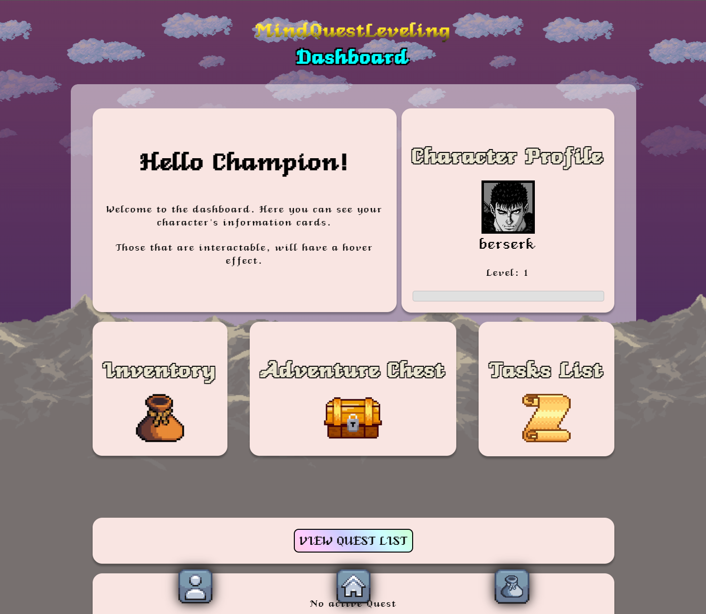

# Mind Quest Leveling (MQL)

## Overview
Mind Quest Leveling (MQL) is a web application that integrates gamification with mental health support. The app helps users manage their goals and make the most of their free time by engaging in enjoyable, game-like activities. It features automatic character creation based on user input, tailored quest assignments to encourage positive behavior, and rewards for completing quests, such as new items. The application is built using **Angular** and **ThreeJS** for the frontend, with **NodeJS** and **MongoDB** handling the backend.

### Dashboard

## Features

### User Profile
- Create an account with secure password standards.
- Automatically generate a character and assign an RPG class based on lifestyle.
- Change the assigned RPG class.
- Input personality type based on the 16 personality test.

### Leveling System
- Earn experience points (XP) from completing the quests.

### Quests
- Quests are predefined according to the user’s assigned class.
- Designed to motivate and reinforce positive behaviors.
- Includes universal quests like meditation or self-improvement tasks.

### Adventure Chest
- Receive an **Adventure Chest** after completing quests.
- Chests contain various rewards such as new weapon skins, items and cosmetics.
- Items are classified by rarity: Basic, Heroic, Mythic, Legendary.

### Items & Inventory
- Rewards from quests include new character designs, weapon skins, and cosmetics.
- Items are classified by rarity (Basic, Heroic, Mythic, Legendary).
- Organize and sort items within the inventory.

### Other Features
- **Browser Pop-ups**: Get notifications for available quests or reminders.
- **Tasks**: Engage in psychological tasks, mindfulness exercises, and educational content.

## Development

### Frontend
- **Angular**: Main framework for building the user interface.
- **ThreeJS**: For rendering 3D graphics.

### Backend
- **NodeJS**: Server-side logic.
- **MongoDB**: Database management.

## Installation & Usage

### Development Server
1. Navigate to the project directory.
2. Run `ng serve` to start the development server.
3. Open `http://localhost:4200/` in your browser. The application will reload automatically with changes to the source files.

### Building the Project
- Run `ng build` to compile the project. The build artifacts will be stored in the `dist/` directory.

### Running Tests
- **Unit Tests**: Run `ng test` using [Karma](https://karma-runner.github.io) to execute unit tests.
- **End-to-End Tests**: Run `ng e2e` for end-to-end tests. You need to install a package that supports e2e testing first.

### Server Installation
1. Navigate to the `/server/` directory.
2. Run `npm install` to install server dependencies.

### Running the Server
- Start the server with `node server.js`.
